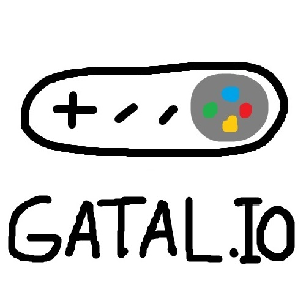

<h1 align="center">WELCOME TO GATAL.IO !!!</h1>
<p align="center"> </p>

Gatal.io adalah salah satu platform _e-commerce_ Indonesia untuk menjual barang-barang digital, termasuk _video game indie_, _asset game_, musik, dan banyak lagi.

# Tugas 2
### Proses Pembuatan Proyek Django hingga Melakukan Deployment ke PWS:
- [x] Membuat sebuah proyek Django baru.
1. Buat repositori baru di Github dengan nama ```gatal.io```
2. Buat direktori lokal dan hubungkan dengan repositori di Github dengan _mantra_ :
    ```bash
    git init 
    git remote add origin https://github.com/viscasa/gatal.io.git
    ```
3. Buat _virtual environment_ dengan menjalankan _command_ berikut di direktori lokal:
    ```bash
    python -m venv env
    ```
4. Aktifkan _virtual environment_ dengan _command_ berikut di direktori lokal:
    ```bash
    env\Scripts\activate
    ```
5. Di direktori yang sama, tambahkan _file_ `requirements.txt` untuk membuat _dependencies_ yang berisikan:
    ```
    django
    gunicorn
    whitenoise
    psycopg2-binary
    requests
    urllib3
    ```
6. Lakukan instalasi terhadap _dependencies_ tadi dengan _command_ berikut:
    ```bash
    pip install -r requirements.txt
    ```
7. Buat proyek Django bernama `gatal_io` dengan _command_ berikut:
    ```bash
    django-admin startproject gatal_io .
    ```

- - - -

- [x] Membuat aplikasi dengan nama `main` pada proyek tersebut.
1. Mengubah `ALLOWED_HOSTS` di file `settings.py` pada direktori proyek untuk keperluan deployment dengan menambahkan:
    ```
    ...
    ALLOWED_HOSTS = ["localhost", "127.0.0.1", "alwie-attar-gatalio.pbp.cs.ui.ac.id"]
    ...
    ```
2. Membuat aplikasi `main` dengan _command_:
    ```bash
    python manage.py startapp main
    ```

- - - -
- [x] Melakukan _routing_ pada proyek agar dapat menjalankan aplikasi `main`.
1. Mendaftarkan aplikasi `main` ke dalam `setting.py`:
    ```python
    INSTALLED_APPS = [
    ...,
    'main'
    ]
    ```

- - - -

- [x] Membuat model pada aplikasi `main` dengan nama `Product` dan memiliki atribut wajib sebagai berikut.
    - `name`
    - `price`
    - `description`
1. Isi _file_ `models.py` di direktori `main` dengan kode berikut:
    ```python
    from django.db import models

    class Product(models.Model):
        name = models.CharField(max_length=255)
        price = models.IntegerField()
        description = models.TextField()
        rating = models.FloatField()
        genre = models.TextField()
    ```
2. Jalankan _command_ berikut untuk membuat migrasi model:
    ```bash
    python manage.py makemigrations
    ```
3. Jalankan _command_ berikut untuk menerapkan migrasi ke dalam basis data lokal.
    ```bash
    python manage.py migrate
    ```

- - - -

- [x] Membuat sebuah fungsi pada views.py untuk dikembalikan ke dalam sebuah template HTML yang menampilkan nama aplikasi serta nama dan kelas kamu.

1. Buat direktori baru bernama `templates` di dalam direktori aplikasi `main`.
2. Di dalam direktori `templates`, buat _file_ baru bernama `main.html`. Isi _file_ `main.html` dengan kode berikut:
    ```html
    <h1 align="center">WELCOME TO GATAL.IO !!!</h1>

    <h5>Name: {{ name }}</h5>
    <h5>Class: {{ class }}</h5>
    ```
3. Buka _file_ `views.py` yang terletak di dalam direktori `main`. Lalu ubah isinya menjadi kode berikut:
    ```python
    from django.shortcuts import render

    def show_main(request):
        context = {
            'name': 'Alwie Attar Elfandra',
            'class': 'PBP D'
        }

        return render(request, "main.html", context)
    ```

- - - -

- [x] Membuat sebuah routing pada urls.py aplikasi main untuk memetakan fungsi yang telah dibuat pada views.py.
1. Buat _file_ `urls.py` di dalam direktori `main`
2. Isi file tersebut dengan kode:
    ```python
    from django.urls import path
    from main.views import show_main

    app_name = 'main'

    urlpatterns = [
        path('', show_main, name='show_main'),
    ]
    ```
3. _Routing_ url pada file `urls.py` di direktori `gatal_io` sehingga isi file `urls.py` menjadi:
    ```python
    from django.contrib import admin
    from django.urls import path, include

    urlpatterns = [
        path('admin/', admin.site.urls),
        path('', include('main.urls'))
    ]
    ```

- - - -

- [x] Melakukan deployment ke PWS terhadap aplikasi yang sudah dibuat sehingga nantinya dapat diakses oleh teman-temanmu melalui Internet.
1. Lakukan tes pada proyek Django yang sudah kamu buat dengan menjalankan perintah `python manage.py runserver`
2. Buka http://localhost:8000/ di incognito mode
3. Jika proyek sudah aman, anda bisa matikan Django servernya dan melakukan deploy ke situs PWS.
4. Pastikan Anda sudah melakukan registrasi pada situs PWS (https://pbp.cs.ui.ac.id/) dan sudah membuat proyek di PWS tersebut.
5. Jalankan perintah yang terdapat pada informasi _Project Command_ pada halaman PWS, maka proyek anda sudah berhasil di-_deploy_ ke PWS.
6. Apabila kedepannya ada perubahan pada proyek Django Anda yang ingin Anda push ke PWS, jalankan _command_ berikut:
    ```bash
    git push pws main:master
    ```

- - - -

<h3 align="center">
Bagan <i>Request User</i> ke <i>Web</i> Aplikasi berbasis Django
</h3>

<p align="center"> 
    
</p>

Request dari user akan diproses terlebih dahulu sehingga dapat diteruskan ke View yang sesuai. kemudian View tersebut akan membaca/menulis data di Model dan menggunakan Template yang sesuai untuk menampilkan dan mengembalikan response ke user.

- - - -

### Fungsi Git dalam Pengembangan Perangkat Lunak
1. **Versi Kontrol:** Git memungkinkan pengembang melacak perubahan kode sumber dari waktu ke waktu. Setiap perubahan disimpan sebagai versi (_commit_), sehingga mudah untuk kembali ke versi sebelumnya jika diperlukan.

2. **Kolaborasi Tim:** Dengan Git, banyak pengembang dapat bekerja secara bersamaan di proyek yang sama tanpa saling mengganggu pekerjaan satu sama lain. _Branching_ (pembuatan cabang) mempermudah pekerjaan di fitur yang berbeda sebelum digabungkan (_merged_) ke cabang utama.

3. **Pemecahan Konflik:** Git memudahkan deteksi dan resolusi konflik kode ketika dua atau lebih pengembang mengedit file yang sama.

4. **Backup & Repositori Terdistribusi:** Git menyimpan salinan lengkap dari repositori di setiap mesin yang menggunakannya, sehingga kode aman jika server pusat tidak dapat diakses atau hilang.

5. **Branching dan Merging:** Git memungkinkan pembuatan cabang (_branch_) untuk pengembangan fitur baru atau eksperimen tanpa mempengaruhi kode utama. Setelah diuji, perubahan dari cabang ini bisa digabungkan (_merge_) ke cabang utama.

- - - -

### Mengapa Framework Django Dijadikan Permulaan Pembelajaran Pengembangan Perangkat Lunak?

1. Django menggunakan Python yang mudah dipahami, cocok untuk pemula.
2. Banyak fitur bawaan yang langsung siap digunakan tanpa konfigurasi tambahan.
3. Arsitektur Model-View-Template (MVT) membantu pemula memahami struktur kode yang baik.
4. Dokumentasi yang lengkap dan mudah diikuti memudahkan pembelajaran.
5. Komunitas besar dan aktif menyediakan banyak sumber belajar dan bantuan.

- - - -

### Mengapa Model pada Django Disebut sebagai ORM?

Model pada Django disebut sebagai **ORM** (Object-Relational Mapping) karena berfungsi sebagai penghubung antara objek Python dan tabel dalam database relasional. Dengan ORM, pengembang dapat berinteraksi dengan database menggunakan kode Python tanpa harus menulis query SQL secara langsung. Setiap model merepresentasikan tabel dalam database, di mana kolom menjadi atribut objek Python. ORM memudahkan operasi seperti insert, update, dan query data, serta memungkinkan otomatisasi manajemen skema database dan mendukung berbagai jenis database. Selain itu, ORM juga menangani relasi antar tabel dengan mudah, menjadikan pengelolaan data lebih intuitif dan aman.

# Tugas 3
### Mengapa Kita Memerlukan _Data Delivery_ dalam Pengimplementasian Sebuah Platform?

_Data delivery_ diperlukan dalam pengimplementasian sebuah platform untuk memastikan informasi dapat ditransfer secara efisien, cepat, dan aman antara server dan klien. Ini sangat penting dalam platform yang membutuhkan interaksi real-time, seperti _game multiplayer_ atau aplikasi berbasis _cloud_, di mana data harus dikirim dan diterima tanpa jeda signifikan agar pengalaman pengguna tetap lancar. Selain itu, _data delivery_ juga mendukung pemrosesan dan analisis data yang diperlukan untuk meningkatkan performa platform, serta menjaga keamanan dan reliabilitas dalam skala besar seiring dengan bertambahnya pengguna.

- - - -

### Mana yang Lebih Baik antara XML dan JSON?

Saya sendiri lebih menyukai JSON, karena formatnya yang lebih mudah dibaca oleh manusia. Selain itu, format JSON yang cenderung memiliki karakter lebih sedikit dari format lain seperti XML memungkinkan JSON untuk diproses lebih cepat dan lebih populer daripada format lain.

- - - -

### Fungsi dari Method `is_valid()` pada form Django

Method `is_valid()` digunakan untuk memvalidasi isi input dari _form_ tersebut. Dengan memanggil is_valid(), kita bisa menghindari kesalahan dan input data yang tidak konsisten, serta memberikan _feedback_ kepada pengguna jika terdapat kesalahan dalam input mereka. Hal ini untuk menjaga agar data yang diproses tetap aman dan sesuai dengan ketentuan yang telah ditetapkan.

- - - -

### Alasan Kita Membutuhkan `csrf_token` Saat Membuat form di Django?

Fungsi `csrf_token` pada pembuatan form di Django adalah untuk melindungi aplikasi web dari serangan **Cross-Site Request Forgery (CSRF)**. Dengan menyertakan token ini dalam setiap form, Django memastikan bahwa setiap permintaan yang diajukan berasal dari sumber yang sah (yaitu, dari pengguna yang sah di situs tersebut), mencegah aksi tidak sah yang dapat dilakukan oleh penyerang dari situs eksternal. Token ini unik untuk setiap sesi dan permintaan, sehingga meningkatkan keamanan aplikasi web.

- - - -

### Proses Pembuatan _Input Form_ hingga Membuat _Routing URL_ untuk Masing-Masing Views

- [x] Membuat input _form_ untuk menambahkan objek model pada app sebelumnya.

1. Menambahkan direktori `templates` di direktori utama dan `base.html` sebagai _template_ dasar yang dapat digunakan sebagai kerangka umum dari halaman lainnya.

2. Menambahkan lokasi direktori `templates` tersebut ke `settings.py` di direktori `gatal_io`:
    ```python
    TEMPLATES = [
        {
            . . .
            'DIRS': [BASE_DIR / 'templates'],
            . . .
        },
    ]
    ```

3. Menampilkan database ke dalam laman utama, yaitu `main.html` dan juga menjadi _extend_ dari `base.html` di direktori utama:
    ```html
    <h1 align="center">WELCOME TO GATAL.IO !!</h1>
    <p align="center"> </p>

    <h5>Name: {{ name }}</h5>
    <h5>Class: {{ class }}</h5>

    
    <p>Belum ada data game pada gatal.io.</p>
    
    <table>
        <tr>
            <th>Game Name</th>
            <th>Time</th>
            <th>Genre</th>
            <th>Description</th>
            <th>Price</th>
        </tr>

        
        <tr>
            <td>{{product_entry.name}}</td>
            <td>{{product_entry.time}}</td>
            <td>{{product_entry.genre}}</td>
            <td>{{product_entry.description}}</td>
            <td>{{product_entry.price}}</td>
        </tr>
        
    </table>
    

    <br />

    <div align="center">
        <a href="">
            <button>Add New Game</button>
        </a>
    </div>

    
    ```

4. Mengubah _Primary Key_ dari _Integer_ menjadi UUID lalu lakukan migrasi seperti cara di tugas sebelumnya. Hal ini dapat dilakukan dengan cara menambahkan kode berikut di `models.py` pada direktori `main`:
    ```python
    import uuid  # tambahkan baris ini di paling atas
    ...
    class MoodEntry(models.Model):
        id = models.UUIDField(primary_key=True, default=uuid.uuid4, editable=False)  # tambahkan baris ini
        . . .
    ...
    ```

5. Membuat `forms.py` di direktori `main` dengan isi:
    ```python
    from django.forms import ModelForm
    from main.models import Product

    class ProductForm(ModelForm) :
        class Meta:
            model = Product
            fields = ["name", "genre","description", "price"]
    ```

6. Menambahkan Method `create_product_entry` untuk menambah entri database di file `views.py` di direktori `main`
    ```python
    def create_product_entry(request):
        form = ProductForm(request.POST or None)

        if form.is_valid() and request.method == "POST":
            form.save()
            return redirect('main:show_main')

        context = {'form': form}
        return render(request, "create_product_entry.html", context)
    ```

7. Mengimplementasikan form yang tadi sudah dibuat ke dalam laman baru dengan template html yang baru `create_product_entry.html` di direktori `main/templates`.

8. Routing URL ke laman yang bersangkutan di file `urls.py` di direktori `main`:
    ```python
    urlpatterns = [
        . . .
        path('create_product_entry', create_product_entry, name='create_product_entry'),
        . . .
    ]
    ```

- - - -

- [x] Tambahkan 4 fungsi _views_ baru untuk melihat objek yang sudah ditambahkan dalam format XML, JSON, XML _by ID_, dan JSON _by ID_.

1. Menambahkan fungsi-fungsi yang diperlukan untuk menampilkan JSON dan XML baik secara keseluruhan maupun per entri database. Tambahkan kode berikut di `views.py` pada direktori `main`:
    ```python
    def show_xml(request):
        data = Product.objects.all()
        return HttpResponse(serializers.serialize("xml", data), content_type="application/xml")

    def show_json(request):
        data = Product.objects.all()
        return HttpResponse(serializers.serialize("json", data), content_type="application/json")

    def show_xml_by_id(request, id):
        data = Product.objects.filter(pk=id)
        return HttpResponse(serializers.serialize("xml", data), content_type="application/xml")

    def show_json_by_id(request, id):
        data = Product.objects.filter(pk=id)
        return HttpResponse(serializers.serialize("json", data), content_type="application/json")
    ```

- - - -

- [x] Membuat routing URL untuk masing-masing _views_ yang telah ditambahkan pada poin 2.

1. Merouting kembali URL yang bersangkutan di file `urls.py` di direktori `main`:
    ```python
    urlpatterns = [
        . . .
        path('xml/', show_xml, name='show_xml'),
        path('json/', show_json, name='show_json'),
        path('xml/<str:id>/', show_xml_by_id, name='show_xml_by_id'),
        path('json/<str:id>/', show_json_by_id, name='show_json_by_id'),
    ]
    ```

- - - -

### _Screenshot_ Postman

1. **JSON**
<p align="center"> 
    
</p>

2. **JSON by ID**
<p align="center"> 
    
</p>

3. **XML**
<p align="center"> 
    
</p>

4. **XML by ID**
<p align="center"> 
    
</p>
